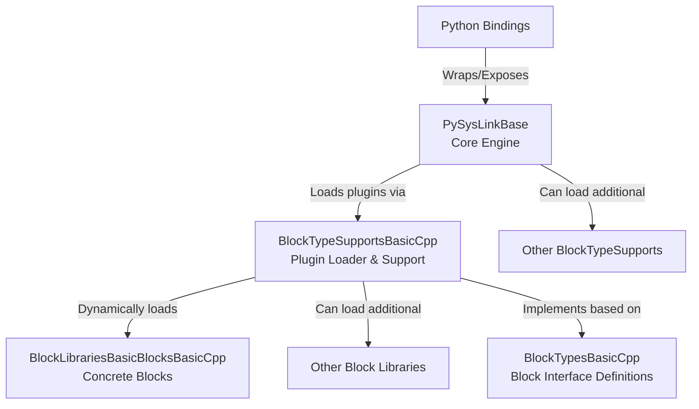

# PySysLink – Open Source Block-Based Simulation Framework

**PySysLink** is a modular, open source simulation framework inspired by tools like Simulink. Designed for scientific computing, control engineering, and dynamic system modeling, PySysLink lets you define and simulate complex systems using a flexible architecture powered by **C++**, **Python**, and **VSCode**.

📘 **Documentation**: [https://pysyslink.readthedocs.io/en/latest/](https://pysyslink.readthedocs.io/en/latest/)

## 🧩 What is PySysLink?

PySysLink is an open and extensible alternative to proprietary simulation tools. It allows users to:

- ⚙️ **Define simulation models** using a visual block editor.
- 🔄 **Run dynamic system simulations**, model physical systems, control loops, and cyber-physical architectures in a unified simulation engine.
- 🧱 **Create and load plug-ins** for defining new blocks with greate flexibility.
- 🐍 **Control simulations from Python**, using high-performance bindings to the C++ core.

## 🚀 Key Features

- **Modular Architecture:** Core simulation logic is decoupled from block implementations.
- **Plug‑In Support:** Easily add new block libraries without modifying the core engine.
- **C++ Core, Python Integration:** Use a high-performance C++ backend with Python interfaces for parameter initialization, execution, and full simulation control
- **Text-Based Model Definitions:** Easily write and share simulation models using human-readable config files.
- **Open and Community‑Driven:** An open source alternative to proprietary simulation tools, built using widely adopted programming standards.

## PySysLink Structure

## Repository Structure

The PySysLink organization is composed of several interrelated repositories:

### 1. **PySysLinkBase**

This is the **core simulation engine**. It provides the fundamental interfaces and classes for:
- Parsing YAML model descriptions.
- Managing simulation blocks and their interconnections.
- Handling events and simulation outputs.
- Managing both discrete and continuous dynamics.

PySysLinkBase is intended to be installed system‑wide so that plug‑ins and extensions can locate and interface with its well‑defined API.

### 2. **BlockTypes**

BlockTypes repositories (e.g., **BlockTypesBasicCpp**) define the abstract interfaces and base classes for blocks. These repositories describe what a simulation block is, independent of any specific simulation engine. They are intentionally kept lightweight and decoupled from PySysLinkBase, allowing for flexibility and reuse in other simulation contexts.

### 3. **BlockTypeSupports**

These repositories serve as bridges between the core simulation engine (PySysLinkBase) and concrete block implementations. For example, **BlockTypeSupportsBasicCpp**:
- Depends on both PySysLinkBase and BlockTypesBasicCpp.
- Implements support for blocks written in C++.
- Acts as a plug‑in for PySysLinkBase, loading further plug‑ins that provide concrete block libraries.

### 4. **BlockLibraries**

BlockLibraries (e.g., **BlockLibrariesBasicBlocksBasicCpp**) provide the actual, concrete block implementations (such as Constant, Sumator, Integrator, and Display blocks). They follow a naming convention (e.g., starting with “BlockLibraries” and ending with “BasicCpp”) that identifies them as compatible with a specific block type support. These libraries are loaded by their corresponding BlockTypeSupports modules.

### 5. **PySysLinkBasePythonBindings**

This repository contains the Python bindings for PySysLinkBase, generated (for example) using tools like Litgen with pybind11 or nanobind. These bindings expose the core simulation engine’s functionality to Python, allowing users to configure and run simulations from within Python scripts.

## How It Works

1. **Model Definition:**  
   Users write a YAML file describing their simulation model—defining blocks, interconnections, and parameters.

2. **Simulation Execution:**  
   PySysLinkBase parses the YAML, instantiates blocks (via plug‑ins loaded through BlockTypeSupports), and runs the simulation by processing block events and propagating signals.

3. **Output Capture:**  
   The simulation engine captures outputs (and events) from blocks. These outputs can be logged to the console, visualized in a GUI, or written to files.

4. **Extension via Plug‑Ins:**  
   New block libraries or support modules can be added as plug‑ins, allowing PySysLink to be extended with additional block types or capabilities without modifying the core engine.
